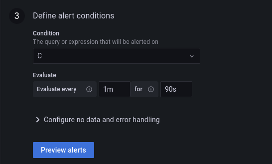

# Telegraf, InfluxDB and Grafana (TIG) with Docker


*Last update on 2023-06-14*

This document explains how to set up Grafana with Influx DB using docker containers and configuring the reverse proxy to access the Grafana dashboard over HTTPS.
This guide was tested using the following OSs/Images:
- Ubuntu Desktop 22.04.2 LTS or Ubuntu Server 22.04.2 LTS
- Docker images:
    - influxdb 2.7.1
    - telegraf 1.26.2
    - grafana/grafana-oss 8.4.3

## How to step-by-step guide

### Server Preparation

1. Update and upgrade ubuntu -> `sudo apt update && sudo apt upgrade`
2. If ubuntu desktop install ssh `sudo apt install ssh`
3. If ubuntu desktop install git `sudo apt install git`
4. Set a static ip address https://www.freecodecamp.org/news/setting-a-static-ip-in-ubuntu-linux-ip-address-tutorial/, force change `sudo systemctl restart systemd-networkd`. NOTE: if you are using a terminal, follow the next sub-steps
    1. Edit or create the `yaml` network configuration file on `/etc/netplan/` -> `sudo nano /etc/netplan/00-installer-config.yaml`
    2. Example:
        ```yaml
        network:
        ethernets:
          eth0:
            dhcp4: no
            addresses: [192.168.168.1/24]
            gateway4: 192.168.168.1
            nameservers:
              addresses: [8.8.8.8, 8.8.4.4]
        version: 2
        ```
    3. After saving the file, run `sudo netplan apply`
    4. Check IP address: `ip add show`
    5. If changes haven't applied yet, run `sudo systemctl restart systemd-networkd`
5. Clone this repository `git clone https://github.com/Ensign-College/tig-docker.git`
6. Make sure you are working in the root directory of the cloned repository. This will most commonly be on `/home/{USER}/tig-docker`. To change to that directory, run `cd /home/{USER}/tig-docker`

### ProxMox nodes preparation (to be accessed by Telegraf)

ProxMox node data should be collected through the official proxmox telegraf input plugin. We need to create a user with permissions and an api token for each ProxMox cluster to be able to retrieve VMs and Containers data from each ProxMox node.

On the ProxMox cluster:
1. Connect through ssh to one of the ProxMox nodes (`ssh root@{PROXMOX_NODE_IP_ADDRESS}`) and enter the corresponding credentials
2. Run the following command to create api user with permissions, save the generated token
    ```bash
    ## Create a influx user with PVEAuditor role
    pveum user add influx@pve
    pveum acl modify / -role PVEAuditor -user influx@pve
    ## Create a token with the PVEAuditor role
    pveum user token add influx@pve monitoring -privsep 1
    pveum acl modify / -role PVEAuditor -token 'influx@pve!monitoring'
    ```
**NOTE:** This process must be repeated in each of the desired clusters to be monitored

### Telegraf Configurations


Telegraf must be installed and configured on each server to collect data. There are two important different configurations to set up:
1. Collect data (like cpu use, disk usage, memory usage or network usage) from a physical servers like a `Linux Server`.
2. Collect data (like cpu load, disk usage or memory usage) from `ProxMox VMs and Containers` individually.

#### Collect data from Linux Servers

The preconfiguration to collect data from proxmox VMs and containers using the `[[inputs.proxmox]]` input plugin is located in `/telegraf/server.telegraf.conf`. This telegraf agent configuration should be done on each physical/host server.

Linux Server configurations step-by-step (as root)
1. If necesary, install git `apt-get install git`
2. Install Telegraf
    ```bash
    # influxdata-archive_compat.key GPG Fingerprint: 9D539D90D3328DC7D6C8D3B9D8FF8E1F7DF8B07E
    wget -q https://repos.influxdata.com/influxdata-archive_compat.key
    echo '393e8779c89ac8d958f81f942f9ad7fb82a25e133faddaf92e15b16e6ac9ce4c influxdata-archive_compat.key' | sha256sum -c && cat influxdata-archive_compat.key | gpg --dearmor | tee /etc/apt/trusted.gpg.d/influxdata-archive_compat.gpg > /dev/null
    echo 'deb [signed-by=/etc/apt/trusted.gpg.d/influxdata-archive_compat.gpg] https://repos.influxdata.com/debian stable main' | tee /etc/apt/sources.list.d/influxdata.list
    apt-get update && apt-get install telegraf
    ```
3. Clone the repository `git clone https://github.com/Ensign-College/tig-docker.git` (a possible good location is in the root directory `/`)
4. Remove the default telegraf config file `rm /etc/telegraf/telegraf.conf`
5. Copy `{REPOSITORY_ROOT_DIRECTORY}/telegraf/server.telegraf.conf` file to your local enviroment `cp ./telegraf/server.telegraf.conf /etc/telegraf/telegraf.conf`
6. Replace the following data on the `telegraf.conf` file:
    - `INFLUXDB_IP_ADDRESS`: InfluxDB IP Address
    - `DOCKER_INFLUXDB_ADMIN_TOKEN`: InfluxDB Admin user token
    - `DOCKER_INFLUXDB_ORGANIZATION`: InfluxDB organization (`TechLab` is a possible value)
    - `DOCKER_INFLUXDB_BUCKET`: InfluxDB Bucket (`servers` is a possible value)
    ```toml
    [[outputs.influxdb_v2]]
    ## The URLs of the InfluxDB cluster nodes.
    ##
    ## Multiple URLs can be specified for a single cluster, only ONE of the
    ## urls will be written to each interval.
    ##   ex: urls = ["https://us-west-2-1.aws.cloud2.influxdata.com"]
    urls = ["http://{INFLUXDB_IP_ADDRESS}:8086"]

    ## Token for authentication.
    token = "{DOCKER_INFLUXDB_ADMIN_TOKEN}"

    ## Organization is the name of the organization you wish to write to; must exist.
    organization = "{DOCKER_INFLUXDB_ORGANIZATION}"

    ## Destination bucket to write into.
    bucket = "{DOCKER_INFLUXDB_BUCKET}"
    ```
7. Start telegraf service `systemctl start telegraf`
8. Enable telegraf service `systemctl enable telegraf`
9. Check if telegraf is properly working `systemctl status telegraf`. If the service is active, now this server is sending data to `InfluxDB`

#### Collect data from ProxMox VMs and Containers (ProxMox clusters/nodes)

The preconfiguration to collect data from proxmox VMs and containers using the `[[inputs.proxmox]]` input plugin is located in `/telegraf/proxmox.telegraf.conf`. When the docker container is built, it copies this file from the host machine inside the Telegraf docker container setting up our custom configuration for ProxMox servers. If you want to customize these configurations, you need to edit this file and build the container again.

It needs to be set up at least 1 input in the telegraf config file so that telegraf works appropriately, the same input plugin type can be added multiple times (this is how all ProxMox nodes can be monitored in the same Grafana dashboard).

Edit the `proxmox.telegraf.conf` file which is located `{REPOSITORY_ROOT_DIRECTORY}/telegraf/proxmox.telegraf.conf` with requested information

```toml
# Provides metrics from Proxmox nodes (Proxmox Virtual Environment > 6.2).
[[inputs.proxmox]]
  ## API connection configuration. The API token was introduced in Proxmox v6.2. Required permissions for user and token: PVEAuditor role on /.
  base_url = "https://{PROXMOX_NODE_IP_ADDRESS}/api2/json" #replace the {PROXMOX_NODE_IP_ADDRESS} with the real one
  api_token = "{USER}@{REALM}!{TOKENID}={UUID}" #replace the full api token with the one created in the previous step

  ## Node name, defaults to OS hostname
  ## Unless Telegraf is on the same host as Proxmox, setting this is required
  ## for Telegraf to successfully connect to Proxmox. If not on the same host,
  ## leaving this empty will often lead to a "search domain is not set" error.
  node_name = "{PROXMOX_NODE_NAME}"

  ## Optional TLS Config
  # tls_ca = "/etc/telegraf/ca.pem"
  # tls_cert = "/etc/telegraf/cert.pem"
  # tls_key = "/etc/telegraf/key.pem"
  ## Use TLS but skip chain & host verification
  insecure_skip_verify = true

  # HTTP response timeout (default: 5s)
  response_timeout = "5s"
```

**NOTE:** You have to add as many sections of `[[inputs.proxmox]]` as proxmox nodes you want or need to configure

### Nginx (enable HTTPS for Grafana)

1. Install `nginx` -> `sudo apt install nginx`
2. Create the directory `sudo mkdir /etc/nginx/ssl`
3. remove the default nginx config file `sudo rm /etc/nginx/sites-enabled/default`
4. Copy `default.conf.example` file to your local enviroment `sudo cp default.conf.example /etc/nginx/sites-enabled/default.conf`
5. Edit the new nginx `default.conf` file -> `sudo nano /etc/nginx/sites-enabled/default.conf` and replace the IP Address with the right one
6. Generate ssl certificates running `sudo openssl req -x509 -nodes -days 3652 -newkey rsa:2048 -keyout /etc/nginx/ssl/nginx-selfsigned.key -out /etc/nginx/ssl/nginx-selfsigned.crt -config ssl-info.txt`
7. Enable `nginx` -> `sudo systemctl enable nginx`
8. Restart `nginx` -> `sudo service nginx restart`
9. Check if nginx accept changes and if is running correctly `nginx` -> `sudo service nginx status`

### Telegraf, InfluxDB and Grafana with Docker

1. Install docker on a Linux Machine: https://docs.docker.com/engine/install/ubuntu/
2. After the installation is completed, make docker run with a non-root user. Use the following guide https://docs.docker.com/engine/install/linux-postinstall/
3. Copy `.env.example` file to your local enviroment
4. Rename `.env.example` file to `.env`
5. Replace all necessary enviromental variables with the proper configuration values (credentials, bucket names, smtp grafana information, etc)
    - InfluxDB information
    - Telegraf configuration file
    - Grafana port or smtp configuration
6. Run `docker compose up -d` or `docker compose up` to build and run all services together
7. Check that all services are running `docker ps`

**NOTE**: This docker compose file comes with `Portainer` to monitoring and manage containers on a web application. Go to `https://{SERVER_IPADDRESS}:9443` to access `Portainer`. On the first try you need to update the `admin` user credentials.

### Testing and Visualizing Data on InfluxDB

As a good practice, we should test if the Telegraf agent is gathering data into InfluxDB. The following is also the process of creating customized queries.
1. Go to `http://{SERVER_IPADDRESS}:8086` and log in with the corresponding credentials
2. Go to Buckets; we should see at least 3 buckets. `_monitoring` and `_tasks` are InfluxDB system buckets. And the other bucket should be the bucket where we are putting and retrieving data. NOTE: the probable name for this bucket should be `proxmox`
3. The first column (FROM) is the bucket name. All the next following columns are filters. In the first filter, we could select our input (from the `proxmox.telegraf.conf`, which inside the docker container is anemd `telegraf.conf`), which is called `proxmox`. This input plugin collects data from each ProxMox VM or container. After selecting filters, click `SUBMIT` to see if everything works in real time. To see what the collected metrics or tags go to https://github.com/influxdata/telegraf/blob/master/plugins/inputs/proxmox/README.md

4. To see the raw flux query click on `SCRIPT EDITOR`. This will show the query as flux query language. This text could be copied to be used on any Grafana dashboard panel.


### Connect InfluxDB to Grafana

To visualize InfluxDB data on Grafana. You need to add a data source in Grafana.

In the Grafana Dashboard
1. Go to `Configurations / Data sources` and click on `Add data source`
2. Select `InfluxDB`
3. Enter connection information
    1. Fill in a data source name
    2. In `Query Language` select `Flux`
    3. In `url` enter the URL from the telegraf docker container -> `http://influxdb:8086` (make sure to add the corresponding port)
    4. Check that `Basic auth` is selected, and under `Basic Auth Details` enter the InfluxDB `user` and `password`
    5. In `InfluxDB Details` enter the following information:
        1. `Organization`: the organization that was set up in the environmental variables
        2. `Token`: the token that was set up in the environmental variables
        3. `Default Bucket`: the default bucket that was set up in the environmental variables. It is probably `proxmox`
4. Click on `Save & Test`. You should see two success messages: `Datasource updated` and `3 buckets found`

 

If more details are needed to connect a data source on Grafana, follow one of these tutorials: https://docs.influxdata.com/influxdb/v1.8/tools/grafana/?t=Flux or https://grafana.com/docs/grafana/latest/datasources/influxdb/

### Grafana dashboard

Once a data source (InfluxDB) is added to Grafana. We could import an existing dashboard to display the data, or we could create a dashboard from scratch.

#### Importing an existing dashboard
1. Select a compatible dashboard for `Flux` language. Go to https://grafana.com/grafana/dashboards/. For this example we are using `ID: 15650` (https://grafana.com/grafana/dashboards/15650-telegraf-influxdb-2-0-flux/)
2. Go to the **`+`** sign and click on `import`.
3. Copy or write the dashboard ID, and click on `load`
4. Edit the dashboard name and folder as wanted, then select the `InfluxDB` database.
5. And after importing the dashboard, we should start seeing data.


#### Create a dashboard from scratch
1. Go to the **`+`** sign and click on `Create`.
2. Click on `Add a new panel`
3. Copy the query from the InfluxDB `SCRIPT EDITOR` (See `Testing and Visualizing Data on InfluxDB` in this guide)
4. Customize this panel on panel on the right side. Click on `apply` to finish

5. Then, we can see the created panel on the new dashboard


### Grafana Alerting

Grafana Alerting helps to learn about problems moments after they occur. It is necesary to:
-   Set up contact points (like destination emails or integrations with third-party apps, like Microsoft Teams or Slack)
-   Set up notification policies to indicate when and to whom the notification will be send
-   Create alert rules to trigger customized system metrics

#### Contact points
1. Go to `alerting/notifications` and click on `Contact points` tab
2. Click on `+ New contact point` or edit the default contact point
3. Give the contact point a name, en then as many contact point types as you want.
##### Email (SMTP)
The SMTP service should be enable in Grafana first to be able to send emails. This step is done replacing the necesary enviroment variables when building the docker containers.
NOTE: in our case we are using gmail SMTP service with a google account with 2FA and credentials through an google app password.
1. Chose `Email` contact type
2. Fill the destinations emails separated by a comma
3. Click on `Save contact point`

##### Microsoft Teams
To enable notifications on Microsoft Teams we need to get an incoming Webhook url from a channel inside a team. Follow this tutorial to get the Webhook url: https://dev.to/niteshsinghal85/sending-grafana-notifications-on-teams-channel-hcn
1. Chose `Microsoft Teams` contact type
2. Fill the url field from the Teams group.
3. Click on `Save contact point`

#### Notification policies
Notification policy link contact points with matching labels. When an alert trigger if a label matches a notification policy condition, this alert notification will be send to the contact point.
1. Add as many `matching labels` a wanted
2. Choose a `Contact point`
3. Click on `Save policy`
#### Create Alert Rule
1. Rule type
    1. Fill the rule name, select Grafana managed alert as rule type and choose a folder
2. Create a query to be alerted on
    1. In the `A` section enter the main query. Example:
    ```
    from(bucket: "servers")
        |> range(start: v.timeRangeStart, stop: v.timeRangeStop)
        |> filter(fn: (r) => r["_measurement"] == "cpu")
        |> filter(fn: (r) => r["_field"] == "usage_user")
        |> aggregateWindow(every: v.windowPeriod, fn: mean, createEmpty: false)
        |> yield(name: "mean")
    ```
    
    2. In the `B` section when can add a query or a expression. Expression can help to set aggregate or reduce values from a time series. In the following example we use a reduce expression to get the last value in the time series for each server (time series) unsing value from the `A` section as input (This is done because only one value per time series can trigger an alert)
    
    3. We can add more expressions or queries. In this case, we set a threshold to trigger the alert when the value from input `B` is bigger than `25% (0.25)`
    
3. Define alert conditions
    1. Select the condition to evaluate. Usually is the last condition/expression. In this example, we select `C` as the condition
    2. Set the evaluation times:
        - Evaluate every: this define how often this evaluation will be done
        - For: Once condition is breached, alert will go into pending state. If it is pending for longer than the "for" value, it will become a trigger (firing) alert.
    
4. Add details for your alert
    1. Fill Summary and/or annotations as wanted. All this information is optional and can be filled in to customize the alert message
    2. Add custom labels. These labels will link the the triggered alert to the notification policy that has the label
    
    
5. Click on `Save and exist`.

Now, every time than an alert is triggered, a notification will be send to the contact points.

**Microsoft Teams**


**Email (via SMTP)**


### Testing
- Test the grafana accessing through `https://{SERVER_IPADDRESS}`
- Test the influxdb accessing through `http://{SERVER_IPADDRESS}:8086`
- Test the portainer accessing through `https://{SERVER_IPADDRESS}:9443`

## Troubleshoot containers

- `docker ps`: shows the current states of all active containers
- `docker logs {CONTAINER_NAME}`: show the last logs from a specific container (ex: this can help to see if something is happing with comunication between Telegrad and ProxMox)
- `docker exec -it {CONTAINER_NAME} bash`: open an interactive terminal session inside the container to navigate or edit files
    - `apt udpate`: to update linux packages inside a container
    - `apt install {PACKAGE_NAME}`: to install a linux package inside a container. Ex: `apt install nano` (to edit config files)
    - `cat {FILE}`: to read the content of a file
    - `nano {FILE}`: to edit the content of a file

# Coming soon...
- Creating metrics alerts (maybe with Grafana, Telegraf, or InfluxDB). This needs to be researched.
    - Templates (improve email body)
- Create reports
- Set InfluxDB on nginx for HTTPS traffic.
